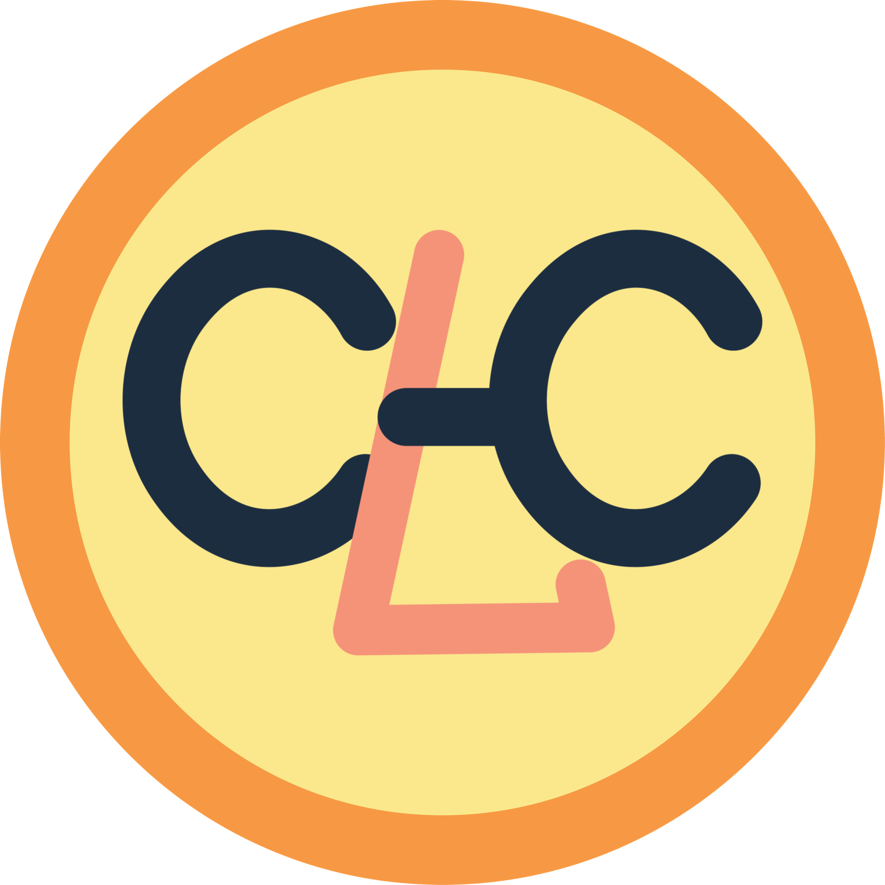

#   Kyle Lin

### Hi! 👋 
I am a Houdini FX artist from Taiwan. I enjoy creating FX simulations and tools for creative solutions or 
speeding up the pipeline. Here is the [***link to my website***](https://kylelinvfx.com) to view more of my work.

## About Me
- 💼 Currently working as a Junior CG Artist at Frame48.
- 💼 Interned at SideFX as an Education and Training Intern in the summer of 2023.
- 🏠 Currently live in Los Angeles.
- 📕 Graduated from the Savannah College of Art and Design in June 2023.
- ✉️ Feel free to email me if you have any questions at ***kylelinvfx@gmail.com***

I am currently working on moving my tools from my personal Google Drive to Github.
I am still learning and setting up everything, so please visit my website to view my works for the mean time and come back later. 
Thank you!

<!---
kylelinvfx/kylelinvfx is a ✨ special ✨ repository because its `README.md` (this file) appears on your GitHub profile.
You can click the Preview link to take a look at your changes.
--->
